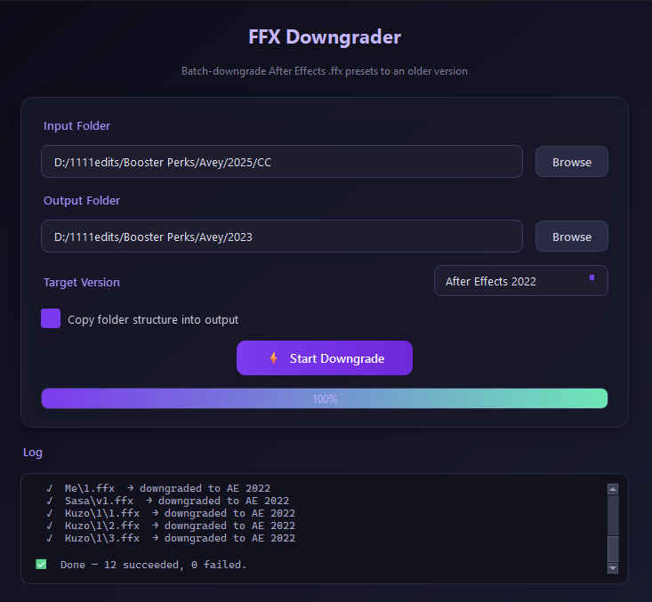

# ⚡ FFX Downgrader

**Batch-downgrade Adobe After Effects `.ffx` preset files to an older AE version — with a single click.**



---

## 🤔 What is this?

After Effects preset files (`.ffx`) are version-locked — a preset saved in **AE 2025** won't open in **AE 2023**. This tool patches the internal version byte so the preset becomes compatible with an older version of After Effects.

### Supported versions

| Target Version | Internal Byte |
|:--------------:|:-------------:|
| AE 2025        | `0x60`        |
| AE 2024        | `0x5F`        |
| AE 2023        | `0x5E`        |
| AE 2022        | `0x5D`        |

---

## ✨ Features

- 🖥️ **Modern dark-themed GUI** — built with PySide6
- 📂 **Recursive folder scanning** — finds every `.ffx` inside subfolders
- 🗂️ **Preserves folder structure** — output mirrors the original directory tree
- 🎯 **Version selector** — pick any supported AE year as the target
- 📊 **Live progress bar & log** — see exactly what's happening in real time
- ⛔ **Cancel at any time** — safely stop a running batch
- ✅ **Non-destructive** — original files are never modified; results are written to the output folder

---

## 🚀 Getting Started

### Requirements

- **Python 3.9+**
- **PySide6**

### Installation

```bash
# Clone or download this repo, then install the dependency:
pip install PySide6
```

### Running the GUI

```bash
python ffx_downgrader_gui.py
```

### Running the CLI (no GUI)

If you just need to downgrade a single file quickly:

```bash
python Main.py path/to/preset.ffx
```

---

## 🛠️ How to Use

1. **Launch** `ffx_downgrader_gui.py`
2. **Input Folder** — click **Browse** and select the folder that contains your `.ffx` files (subfolders are scanned automatically)
3. **Output Folder** — click **Browse** and choose where the downgraded presets should be saved
4. **Target Version** — pick the AE version you want to downgrade *to* (e.g. After Effects 2023)
5. Click **⚡ Start Downgrade** — watch the progress bar and log as files are processed
6. Open the output folder — your downgraded `.ffx` files are ready, with the original folder structure intact

> **Tip:** Files that are *already* at or below the target version are copied as-is so you always get a complete set in the output folder.

---

## 📁 Project Structure

```
ffx downgrader/
├── ffx_downgrader_gui.py   # PySide6 GUI application
├── Main.py                 # Original CLI script
├── preview.png             # Screenshot used in this README
└── README.md               # You are here
```

---

## 📝 License

Free to use and modify. No warranty. Use at your own risk.
